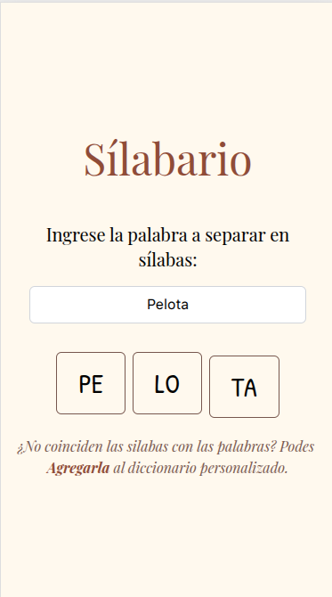

# 📖 Silabario

Aplicación web simple para **generar sílabas a partir de una palabra**, pensada como apoyo en la **enseñanza de la lectura**.

👉 Puedes probarla en línea github pages [l2radamanthys.github.io/silabario](l2radamanthys.github.io/silabario)



---

## ✨ Características

- Separa palabras en sílabas de forma automática.
- Posibilidad de **corregir manualmente** la separación en caso de errores.
- Enfoque educativo para ayudar en el aprendizaje de la lectura.

---

## ⚠️ Limitaciones

El **algoritmo de separación silábica** no es 100% exacto, por lo que en algunos casos puede fallar.  
Por eso, se incluye la opción de **ajustar manualmente** las divisiones generadas.

---

## 🚀 Tecnologías utilizadas

- [React](https://react.dev/) (interfaz)
- [Vite](https://vitejs.dev/) (bundler y build)
- [Tailwind CSS](https://tailwindcss.com/) (estilos)

---

## 📦 Instalación y uso

clona el repositorio e instala las dependencias:

```bash
git clone https://github.com/l2radamanthys/silabario.git
cd silabario
npm install
```

Ejecutar

```
npm run dev
```

Compilar

```
npm run build
```

> Requiere: Node.js 22

---

## Deploy usando dokku

El repositorio esta configurado para publicarlo usando Dokku a traves de un Dockerfile personalizado.

```
dokku apps:create silabario
git remote add dokku dokku@[your-server-url]:silabario
git push dokku main:master -f
```
